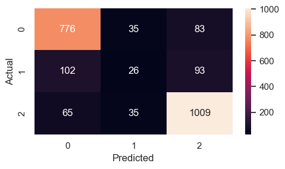
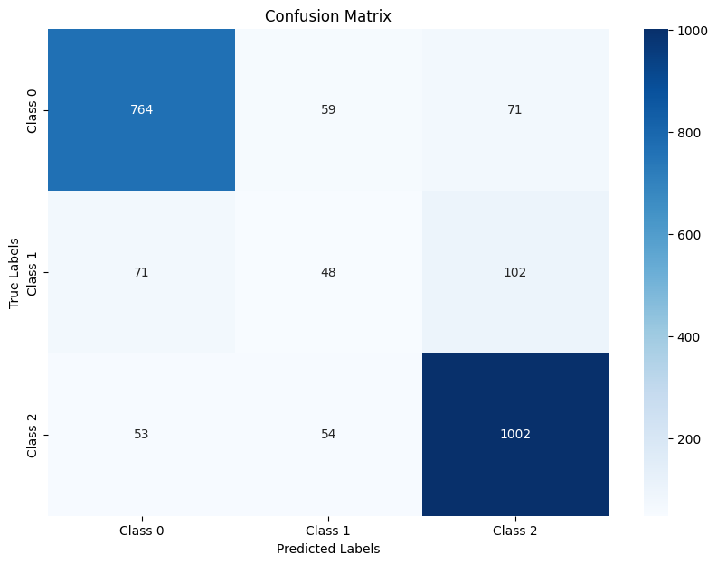

# [PhoBERT Fine-tuning] Vietnamese_Sentiment_Analyst

## Overview
This system combines advanced natural language processing techniques to perform sentiment analysis on Vietnamese text. It utilizes two main models:
### CNN + BiLSTM Model:
- Combines Convolutional Neural Networks (CNN) to extract local features.
- Uses Bidirectional Long Short-Term Memory (BiLSTM) networks to capture long-term context.

### PhoBERT Fine-tuning:
- Utilizes the PhoBERT language model fine-tuned for Vietnamese.
- Adapts the model for specific sentiment analysis tasks.

### Operational Process:
1. Preprocess the Vietnamese text data.
2. Apply both models to analyze sentiment.
3. Combine the results from both models to make the final prediction.
4. Automatically store the results in a database.
5. Deploy the model via a Flask API for easy integration.


## Method
### CNN + BiLSTM
This model combines Convolutional Neural Network (CNN) and Bidirectional Long Short-Term Memory (BiLSTM) to learn features from textual data and classify sentiments.

### PhoBERT Fine-tuning
We use the best model from the AIViVN's competition by [Khoi Nguyen](https://github.com/suicao). The model scored 0.90849 on the public leaderboard

#### Model architecture
Here we created a custom classification head on top of the BERT backbone. We concatenated the last 4 hidden representations of the ```[CLS]``` token, which is actually ```<s>``` in this case, and fed it to a simple MLP.


## Dataset
### UIT-ViSFD
Dowload dataset from https://github.com/LuongPhan/UIT-ViSFD/blob/main/UIT-ViSFD.zip

### Data Information
- Train: 7,786.
- Dev: 1,112.
- Test: 2,224.

## Setup model traning

### Data preprocessing
Using dataset UIT-ViSFD preprcessing in file notebook:
```train\data_preprocessing.ipynb```

### Installing VnCoreNLP

Install the python bindings:

```$pip install  vncorenlp```

Clone the VNCoreNLP repo: https://github.com/vncorenlp/VnCoreNLP

### Downloading PhoBERT 

Follow the instructions in the original repo:

PhoBERT-base:

```
$wget https://public.vinai.io/PhoBERT_base_transformers.tar.gz
$tar -xzvf PhoBERT_base_transformers.tar.gz
```
## Experiments
The training/test loss curves for each experiment are shown below:
- CNN + BiLSTM:
  
  
- PhoBERT Fine-tuning: The model achieved excellent results in fold 0 within the first 20 epochs
  - UC (Area Under the Curve): An AUC score close to 1 indicates that the model has a very good ability to distinguish between classes.
  - F1 Score: The F1 score reflects the balance between precision and recall. A score of 0.7773 is a good result.

## Result Classification report and confussion matrix
- CNN + BiLSTM:
<p align="center">
  <br/>
</p>

- PhoBERT Fine-tuning:

<p align="center">
  <br/>
</p>


  
